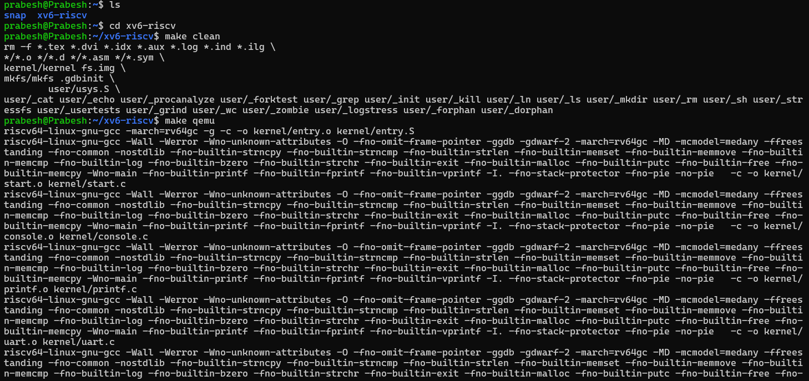
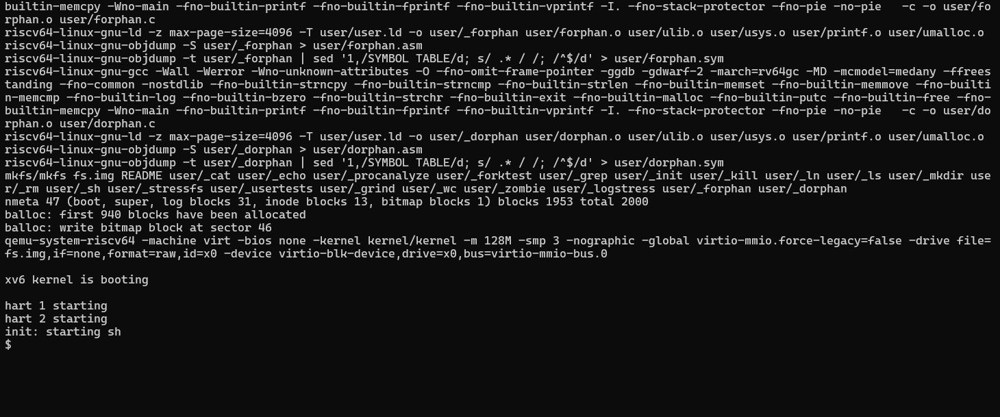
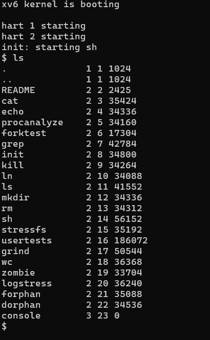
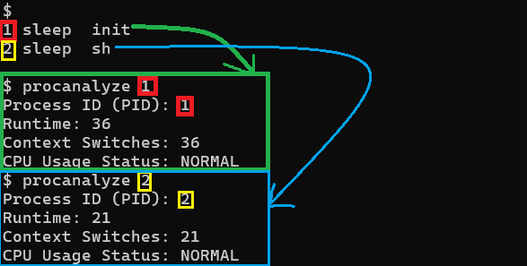
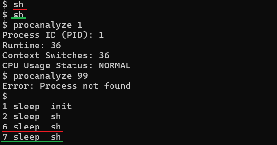
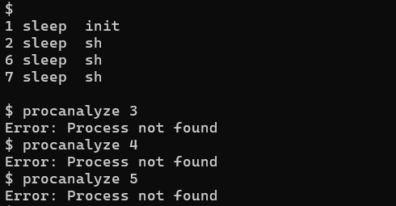
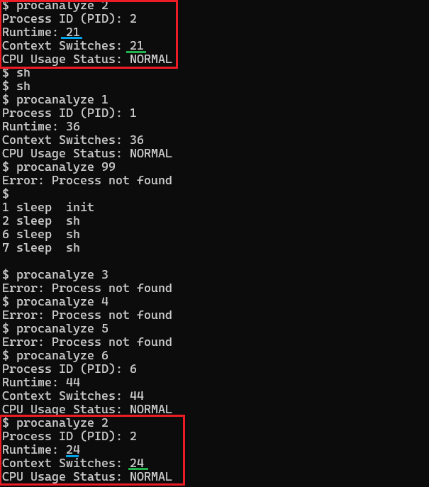

# Modified xv6 OS with Process Statistics and Status Monitoring

## 📌 Overview

This project extends the functionality of the original xv6 (RISC-V) operating system by introducing kernel-level enhancements for **process statistics tracking** and **runtime status monitoring**.

Unlike the base system, which provides minimal visibility into process behavior, this modification enables detailed introspection of process execution characteristics through a custom system call and user-level interface.

---

## 🚀 Key Features (Our Modifications)

### 🔹 1. Process Statistics Tracking

* Added new fields to the process structure (`struct proc`)
* Tracks:

  * Total CPU runtime
  * Number of context switches
  * Execution state

👉 This enables deeper visibility into process lifecycle and scheduling behavior.

---

### 🔹 2. Runtime Monitoring in Scheduler

* Modified the scheduler to:

  * Continuously update runtime of processes
  * Track context switch events
* Provides real-time accumulation of execution metrics

---

### 🔹 3. Custom System Call: `procanalyze`

* Implemented a new system call:

  ```
  procanalyze(int pid)
  ```
* Retrieves and displays:

  * Process ID
  * Runtime statistics
  * Context switch count
  * Current status

---

### 🔹 4. User-Level Command Integration

* Created a user program (`procanalyze.c`)
* Allows easy access from shell:

  ```
  procanalyze 1
  ```

---

## 🧠 Design Philosophy

This project focuses on:

* Minimal but meaningful kernel modifications
* High observability of process behavior
* Clean integration with existing xv6 architecture

---

## ⚙️ Setup & Execution Guide (WSL - Ubuntu)

### 🔹 Step 1: Install Dependencies

```bash
sudo apt update
sudo apt install build-essential qemu-system gcc-riscv64-linux-gnu
```

---

### 🔹 Step 2: Clone Repository

```bash
git clone https://github.com/prabesh6907/Modified-xv6-riscv.git
cd Modified-xv6-riscv
```

---

### 🔹 Step 3: Build and Run xv6

```bash
make clean
make qemu
```

---

## ⚠️ Common Errors & Fixes

### ❌ RISC-V Compiler Error

```
Couldn't find a riscv64 version of GCC
```

✔ Fix:

```bash
sudo apt install gcc-riscv64-linux-gnu
```

---

### ❌ `proc` undeclared

✔ Fix:
Add in `sysproc.c`:

```c
#include "proc.h"
extern struct proc proc[NPROC];
```

---

### ❌ syscall not recognized

✔ Fix:

* Add in `user/user.h`
* Add in `user/usys.pl`

---

### ❌ exec failed

✔ Fix:
Add to `Makefile`:

```
$U/_procanalyze\
```

---

## 🧪 Running the Feature

Inside xv6 shell:

```bash
procanalyze 1
```

👉 PID 1 is always active (`init` process), ensuring consistent output.

---

## 📸 Project Demonstration

### 1. xv6 Boot (Environment Setup Verification)
 <br>

---

 <br>
xv6 operating system successfully booted using the QEMU emulator, confirming correct setup of the development and execution environment.

---

### 2. Default xv6 Functionality
 <br>
Demonstrates the standard xv6 environment and built-in commands before applying our custom modifications.

---

### 3. Process Statistics Analysis
 <br>
Output of the custom `procanalyze` system call displaying process runtime, context switches, and CPU usage status.

---

### 4. Creating Multiple Processes
 <br>
Additional shell processes were created using repeated `sh` commands to simulate a multi-process environment.

---

### 5. Error Handling for Invalid Process ID
 <br>
Demonstrates robust error handling when a non-existent process ID is passed to the `procanalyze` command.

---

### 6. CPU Runtime Tracking
 <br>
Shows increase in CPU runtime over time, validating the correctness of process runtime tracking within the kernel.

---

## 📁 Project Structure (Modified Files)

* `kernel/proc.h` → Added statistics fields
* `kernel/proc.c` → Scheduler tracking logic
* `kernel/sysproc.c` → System call implementation
* `user/procanalyze.c` → User command
* `Makefile` → Build integration

---

## 🎯 Significance of the Work

This enhancement transforms xv6 from a minimal teaching OS into a system capable of:

* Runtime process introspection
* Basic performance monitoring
* Improved understanding of scheduling behavior

---

## 📎 Conclusion

The project demonstrates how small, targeted kernel modifications can significantly enhance system observability. It provides a practical example of extending operating system functionality while maintaining architectural simplicity.

---

## 🙌 Acknowledgment

This project is based on the xv6 (RISC-V) operating system developed by MIT.


You will need a RISC-V "newlib" tool chain from
https://github.com/riscv/riscv-gnu-toolchain, and qemu compiled for
riscv64-softmmu.  Once they are installed, and in your shell
search path, you can run "make qemu".
